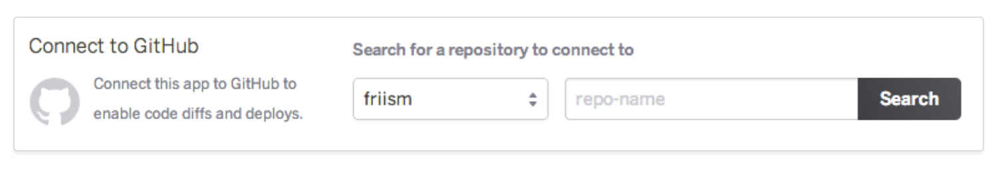

## To DOs App

[App Preview](https://8080-blue-bonobo-kfx0kmne.ws-eu17.gitpod.io/)

#### This is the main page for the To Do App. It is designed to help clients keep track of their work productivity in terms what has been completed and what still need to be done. They are able to manipulate their data and task by adding To Dos, deleted whats has been completed, see their completed task history and get rid of all task once completed.
---
### User Experience (UX)

## user stories
1. First time visters
As a First Time Visitor, I want to easily understand the main purpose of the APP and learn more about the features included in the App.

2. As a First Time Visitor, I want to be able to easily navigate throughout the App to find what i am looking for and be able to add and delete data as easily as possible.

## Returning Visitor Goals
1. As a Returning Visitor, I want to have the same easily user experience.

---

### Design

## Colour Scheme
1. The main colours are yellow and grey for the buttons and a standard beige for the background. The data is made stand-out with light green.

## Typography
1. The 'Oswald', 'Futura' font is the main font used throughout the whole website with Sans Serif as the fallback font in case for any reason the font isn't being imported into the site correctly. 

## Features
1. Interactive elements 

----

### Technologies

## Languages
1. HTML
2. CSS
3. Flatly
4. Python

## Frameworks, Libraries & Programs Used
1. Bootstrap Templates
2. Flask 2.0.2
3. Flask-PyMongo 2.3.0
4. DNSpython 2.1.0
5. Heroku
6. MangoDB Atlas
7. Procfile

---

### Testing
HTML Validator 
CSS Validator 
Python Validator 

### Testing User Stories from User Experience (UX) Section

## First Time Visitor Goals
1. As a First Time Visitor, I want to easily understand the main purpose of the site.

 Upon entering the site, users are greeting with a simple and clear usage of the app. With only 3 clearly labeled buttons for the prefered action.

2. As a First Time Visitor, I want to be able to easily be able to navigate throughout the app.

The app is designed to be simple and clear in its usage. As soon as client logs in they clear are aware of each button and labeled functions

3. Returning Visitor Goals
As a Returning client, they will get exactly the targeted user experience.

---

#### Testing

1. A large amount of testing was done to ensure that all libraries are still appearing in the app as they kept on removing themselves.
Friends and family members were asked to review the site and documentation to point out any bugs and/or user experience issues
 
 ### Bugs
 1. Self deleting libraries but the tutor said as you deploy on Heroku it will not have these problems.

 ---
 #### Deployement 

 ## Github Deployment
 -The project was deployed to GitHub Pages using the following steps : .Log into the GitHub and locate the GitHub Repository
.Go to settings button on the menu
.Scroll down to pages section
.under source click the dropdown named "none" and select "Master Branch"
.Scroll down through the page to find the now published link in GitHub pages section.

## Clone 
On my repos, navigate to the main page of the repository.
Above the list of files, click Code.
To clone the repository using HTTPS, under "Clone with HTTPS", click the clipboard. To clone the repository using an SSH key, including a certificate issued by your organization's SSH certificate authority, click Use SSH, then click the clipboard. To clone a repository using GitHub CLI, click Use GitHub CLI, then click the clipboard.
Open Terminal.
Change the current working directory to the location where you want the cloned directory.
ype git clone, and then paste the URL you copied earlier.
Press Enter to create your local clone.

 ## Heroku deploymet
#### Enabling GitHub Integration
You can configure GitHub integration in the Deploy tab of apps in the Heroku Dashboard.

To configure GitHub integration, you have to authenticate with GitHub. You only have to do this once per Heroku account.

After you link your Heroku app to a GitHub repo, you can selectively deploy from branches or configure auto-deploys.
If you do not have any apps, you must approve integration for your organization from GitHub. For more information about this process, see Approving OAth Apps for your organization.

### Manual Deploys
With manual deploys, you can create an immediate deployment of any branch from the GitHub repo that’s connected to your app. Use manual deploys if you want to control when changes are deployed to Heroku.

You can also use manual deploys to temporarily deploy a branch other than the one that’s configured for automatic deployment. For example, you might have a development app synced to the development GitHub branch, but you temporarily want to test a feature branch. Simply trigger a manual deploy of the feature branch to test it on the Heroku app. Note that release of the feature branch is overwritten on the next successful GitHub push to the development branch.

### Automatic Deploys
When you enable automatic deploys for a GitHub branch, Heroku builds and deploys all pushes to that branch. If, for example, you have a development app on Heroku, you can configure pushes to your GitHub development branch to be automatically built and deployed to that app.

If you’ve configured your GitHub repo to use automated Continuous Integration (with Travis CI, for example), you can check the “Wait for CI to pass before deploy” checkbox. When enabled, Heroku will only auto-deploy after all the commit statuses of the relevant commit show success.
This commit won’t auto-deploy because one of the checks shows a pending status:

This commit will auto-deploy because all of the checks show a status of success:

 1. The project was deployed to Heroku Environment (NgoniDukeMoyo/Recipeswebapp) - Unable to change the name of the cluster hence its still named Recipewebapp from the initial project idea.
  ---
  #### Credits
  1. Bootstrap4: Bootstrap Library used in the project for forms and grids

  ## Content 
  1. Content was created by developer

  ## Images
  1. Images created by developer

  ## Media
  1. My Mentor for continuous helpful feedback and google for continuous research.

  ## Functional Testing 
   1.  The site performs according to the requirement in all versions ( nav-bar, forms and scroll and links all functional).
   2. The site performs auto start facility according to the requirements (the video plays auto when site accessed as required).
   3. The installation of the project can be done smoothly provided the user has the necessary resources and it does not lead to any significant errors (gitphun repo cloning).
   4. The navigation between relevant modules in on the site are as per the requirement (bootstrap nav-bar is fully functional).
   5. The site allows necessary social network options such as sharing, posting and navigation etc (throough footer socials

   ## Performance Testing
  1. The various site and infrastructure bottlenecks which prevent the site to perform at the required acceptability levels has been accessed (boostrap grids are functional).
  2. The response time of the site is as per as the requirements.

  ## Usability Testing
1. The icons are natural and consistent with the site.
2. The buttons, which have the same function have the same color.
3. The text is kept simple and clear to be visible to the users.
4. The short sentences and paragraphs are readable to the end users.

## Compatebility Testing
1. The user Interface of the site is as per the screen size of the device, no text/control is partially invisible or    inaccessible.

## Browser Testing
1. Chrome Version 95.0.4638.69 (Official Build) (x86_64)

  

